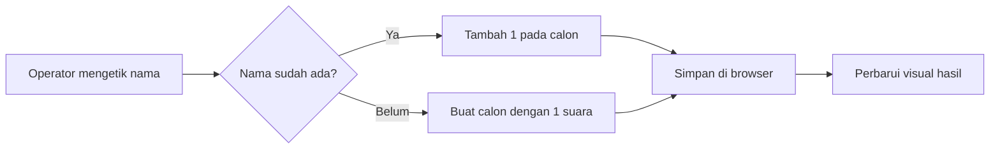

# Perancangan Aplikasi Papan Suara

## 1. Tujuan

Aplikasi web sederhana untuk mencatat suara pemilihan ketua secara langsung. Operator mengetik nama calon, lalu menekan **Tambah 1 suara**. Jika nama itu sudah ada, jumlahnya bertambah; jika belum, calon baru muncul dengan 1 suara. Hasil dapat dilihat sebagai angka, persentase, dan batang perbandingan.

## 2. Keputusan awal

- **Platform:** web statis yang dapat dibuka di komputer atau ponsel dan dipublikasikan melalui Vercel.
- **Penyimpanan:** `localStorage` di browser yang dipakai operator. Tidak ada database atau akun.
- **Cadangan:** hasil dapat diunduh sebagai JSON dan dipulihkan melalui impor JSON.
- **Operasi:** satu operator; formulir dan hasil berada pada layar yang sama.
- **Bahasa:** Indonesia.

Keputusan ini adalah asumsi kerja. Jika diperlukan sinkronisasi otomatis lintas perangkat, arsitektur harus berubah karena situs statis tanpa database tidak dapat menyimpan dan membagikan suara bersama secara aman.

## 3. Fitur versi pertama

1. Ketik nama calon dan tekan Enter atau tombol **Tambah 1 suara**.
2. Nama dibandingkan tanpa membedakan huruf besar/kecil dan spasi berlebih. `Andy`, `andy`, dan ` Andy ` dihitung sebagai satu calon.
3. Calon baru dibuat otomatis dengan 1 suara.
4. Tampilkan total suara, jumlah calon, peringkat, persentase, dan batang suara. Calon dengan suara tertinggi disorot; jika seri, status seri ditampilkan.
5. Satu aksi terakhir dapat dibatalkan.
6. Tombol **Tampilkan hasil ketua** menampilkan calon dengan suara tertinggi sebagai ketua terpilih. Jika suara tertinggi seri, tampilkan para calon yang seri tanpa menetapkan ketua tunggal.
7. Ekspor dan impor cadangan JSON.
8. Hapus seluruh hasil dengan konfirmasi yang jelas.

## 4. Alur utama



## 5. Rancangan layar saat ini: Papan Skor

```text
┌───────────────────────────────────────────────────────────────┐
│ Papan Suara                                  Hasil langsung     │
│ Hasil Pemilihan Ketua                                          │
│ CATAT SUARA  [ Ketik nama calon... ] [ + Tambah 1 suara ]      │
│ PERINGKAT CALON                   4 CALON · TOTAL 60 SUARA      │
│ ┌───────────────────────────────────────────────────────────┐ │
│ │ 01  Samuel   ███████████████        50%       30 SUARA    │ │
│ └───────────────────────────────────────────────────────────┘ │
│ ┌───────────────────────────────────────────────────────────┐ │
│ │ 02  Andy     █████████              30%       18 SUARA    │ │
│ └───────────────────────────────────────────────────────────┘ │
│ ┌───────────────────────────────────────────────────────────┐ │
│ │ 03  Bayu     █████                  18%       11 SUARA    │ │
│ └───────────────────────────────────────────────────────────┘ │
│ ┌───────────────────────────────────────────────────────────┐ │
│ │ 04  Dini     █                       2%        1 SUARA    │ │
│ └───────────────────────────────────────────────────────────┘ │
│ ... baris selanjutnya; halaman dapat digulir                   │
│ [ Tampilkan hasil ketua ] → nama pemenang ditampilkan besar    │
│ Batalkan suara terakhir · Unduh/Pulihkan cadangan · Hapus semua│
└───────────────────────────────────────────────────────────────┘
```

**Arah visual:** sesuai referensi Papan Skor yang dipilih pemilik proyek. Latar biru tua berkontras tinggi, setiap calon dalam baris terang, nama dan jumlah suara jauh lebih besar. Calon teratas diberi warna mint; grafik batang tetap terlihat.

**Jumlah calon dinamis:** tidak ada batas tiga baris pada tampilan. Calon keempat dan seterusnya selalu dibuat sebagai baris baru. Halaman bertambah tinggi dan dapat digulir jika baris melebihi tinggi layar.

**Responsif:** formulir horizontal pada desktop dan vertikal pada ponsel; daftar hasil tetap satu kolom dengan teks yang besar.

## 6. Data dan aturan

Data tersimpan sebagai satu dokumen dengan versi, daftar calon, dan riwayat aksi terakhir. Setiap calon memiliki ID, nama tampilan, dan jumlah suara bilangan bulat. Total suara dihitung dari seluruh calon, bukan disimpan terpisah.

- Nama kosong atau hanya spasi ditolak.
- Panjang nama dibatasi 60 karakter.
- Satu kiriman formulir = tepat satu suara.
- Ketua terpilih dihitung dari suara yang tercatat ketika tombol hasil ditekan. Jika suara berubah, tekan tombol lagi untuk melihat hasil terbaru.
- Persentase dihitung terhadap total suara dan dibulatkan untuk tampilan.
- Impor hanya menerima format cadangan aplikasi yang valid; data tidak valid tidak menggantikan hasil yang ada.
- Nama ditampilkan sebagai teks biasa agar masukan seperti HTML tidak dijalankan.

## 7. Batasan yang perlu diketahui

- Data `localStorage` tersimpan pada browser/perangkat dan alamat situs tertentu. Membuka situs dari perangkat lain tidak menampilkan hasil yang sama secara otomatis.
- Membersihkan data browser dapat menghapus hasil. Unduh cadangan secara berkala selama pemilihan.
- Aplikasi ini menghitung entri operator. Tanpa identitas pemilih, aplikasi tidak memverifikasi hak pilih atau mencegah seseorang dipilih dua kali.
- Vercel meng-host aplikasi statis; GitHub dan Vercel tidak menjadi tempat penyimpanan suara yang sedang berjalan.

## 8. Struktur proyek

```text
papan-suara/
├── index.html          # Struktur antarmuka
├── style.css           # Tampilan responsif
├── app.js              # Pencatatan, penyimpanan, dan visual hasil
├── PERANCANGAN.md      # Dokumen ini
└── README.md           # Cara menjalankan dan mengunggah ke GitHub
```

## 9. Kriteria selesai

- Andy dimasukkan sekali → Andy 1 suara.
- Andy dimasukkan lagi dengan variasi kapital/spasi → Andy 2 suara, tanpa calon duplikat.
- Bayu dimasukkan → Bayu 1 suara.
- Calon keempat, kelima, dan seterusnya tampil sebagai baris baru; halaman dapat digulir tanpa baris terpotong atau disembunyikan.
- Tombol hasil tidak aktif sebelum ada suara; setelah ada suara, pemenang tunggal tampil sebagai ketua. Pada hasil seri, aplikasi tidak menetapkan ketua tunggal.
- Memuat ulang halaman mempertahankan hasil.
- Batalkan mengembalikan tepat satu entri terakhir.
- Cadangan yang diekspor dapat diimpor dan menghasilkan hitungan yang sama.
- Tampilan tetap mudah dibaca pada komputer dan ponsel.

## 10. Urutan pengerjaan

1. Selesaikan rancangan dan antarmuka.
2. Implementasikan pencatatan dan penyimpanan lokal.
3. Tambahkan visual hasil dan cadangan.
4. Uji skenario pada bagian 9.
5. Siapkan panduan unggah ke repository GitHub dan publikasi melalui Vercel.

## 11. Pertanyaan untuk pemilik proyek

1. **Terjawab:** satu perangkat operator dengan cadangan.
2. **Terjawab:** formulir dan hasil berada pada layar yang sama.
3. **Terjawab:** cukup mengetik nama calon, tanpa identitas pemilih.
